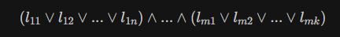
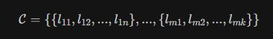
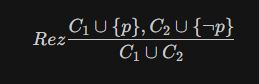
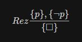
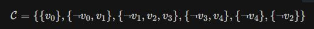
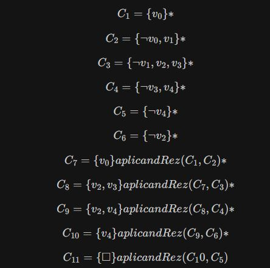
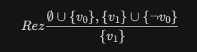
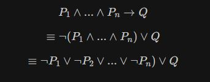

##### Fritz Raluca-Mihaela G243
# <center> FLP </center>
## <center> Laboratorul 8</center>
  
[Rezolutia in logica propozitionala](#rezolutia-in-logica-propozitionala). 
[Rezolutia SLD](#rezolutia-sld)  

##  Rezolutia in logica propozitionala.   

Numim literal in calculul propozitional o variabila sau negatia unei variabile.    

literal := p | ¬p  (p sau ¬p) , unde p este o variabila propozitionala     

Pentru orice formula in logica propozitionala, exista o forma normala conjunctiva echivalenta cu formula initiala.    

O forma normala conjunctiva FNC este reprezentata de o formula formata din conjunctii de disjunctii de literali.  


Daca avem FNC pentru o formala φ, forma clauzala este reprezentata de urmatoarea multime de clauze, unde o clauza este o disjunctie de literali.  


O formula φ este satisfiabila daca si numai daca FNC φ este satisfiabila, daca si numai daca multimea `C` este satisfiabila.  


Regula Rezolutiei pastreaza satisfiabilitatea.  



unde C<sub>1</sub>, C<sub>2</sub> sunt clauze  

Algoritmul Davis-Putnam  

Intrare: o multime `C` de clauze  
Se repeta urmatorii pasi:  
- se elimina clauzele triviale; {p, ¬p} echivalent cu formula p `\/`¬p
- se alege o variabila p  
- se adauga la multimea de clauze toti rezolventii obtinuti prin aplicarea `Rez` pe variabila p  
- sterg toate clauzele care contin p sau ¬p  

Daca la final mutlimea `C` este vida, atunci formula este satisfiabila.
Daca la un pas derivez o cutie, atunci nu este satisfiabila.  



#### Exercitiul 1:
Fie urmatoarea formula in logica propozitionala. Sa se studieze daca formula este satisfiabila.  


Scriem formula clauzala,  





Am obtinut o derivare a lui `BOX` ceea ce inseamna ca multimea de clauze nu este satisfiabila, ceea ce inseamna ca formula data nu este satisfiabila.    


## Rezolutia SLD

``` prolog
Q :- P_1,..., P_n.  
```


#### Exercitiul 2:  

```prolog 
1. r:- p,q.  
2. s:- p,q.   
3. v:- t,u.   
4. w:- v,s.  
5. t.  
6. q.  
7. u.  
8. p.  
```
Sa se verifice daca este satisfacuta urmatoarea tinta: `?- w.`  

Prima data scriem formulele asociate.  
1. ¬p `\/`¬q`\/`r  
2. ¬p `\/` ¬ q `\/` s  
3. ¬t `\/` ¬ u `\/` v  
4. ¬v `\/` ¬ s `\/` w  
5. t  
6. q  
7. u  
8. p  

G<sub>0</sub> = ¬w  
G<sub>1</sub> = ¬v `\/` ¬s (aplicand 4)  
G<sub>2</sub> = ¬t `\/` ¬u `\/` ¬s (aplicand 3)  
G<sub>3</sub> = ¬u `\/` ¬s (aplicand 5)  
G<sub>4</sub> = ¬s (aplicand 7)  
G<sub>5</sub> = ¬p `\/` ¬ q (aplicand 2)  
G<sub>6</sub> = ¬q (aplicand 8)  
G<sub>7</sub> = `BOX` (aplicand 6)  

Am obtinut o derivare a lui Box, respectiv o SLD-respingere, deci tinta w este derivabila din ipotezele programului.  

#### Exercitiul 3  

Fie urmatorul program in Prolog.  

```prolog  
q(X,Y) :- q(Y,X), q(Y,f(f(Y))).   
q(a, f(f(X))).  
```
Sa se verifice daca poate fi satisfacuta tinta `?- q(f(Z),a).`  


1. ¬q(Y,X) `\/` ¬q(Y, f(f(Y))) `\/` q(X,Y)  
2. q(a, f(f(X)))  

G<sub>0</sub> = ¬q(f(Z),a)  
G<sub>1</sub> = ¬q(a,f(Z)) `\/` ¬q(a, f(f(a)))     
        aplicand 1 cu cu substitutia Θ(X) = f(Z) si Θ(Y) = a.    
G<sub>2</sub> = ¬q(a,f(Z))    
        aplicand 2 cu substitutia Θ(X) = a.    
G<sub>3</sub> = `BOX`  
        aplicand 2 cu substitutia Θ(Z) = f(X)    
 
Am obtinut o derivare a lui `BOX`, respectiv o SLD-respingere, deci tinta este satisfacuta.  

#### Exercitiul 4:  

Fie urmatorul proram in Prolog:  

```prolog
1. p(X) :- q(X, f(Y)), r(a).  
2. p(X) :- r(X).  
3. q(X,Y) :- p(Y).  
4. r(X) :- q(X,Y).  
5. r(f(b)).  
```

Sa se verifice daca tinta urmatoare poate fi satisfacuta `?- p(X), q(Y,Z).  

1. q(X, f(Y)) `\/` ¬r(a) `\/` p(X)  
2. ¬ r(X) `\/` p(X)  
3. ¬p(Y) `\/` q(X,Y)  
4. ¬q(X,Y) `\/` r(X)  
5. r(f(b))  

G<sub>0</sub> = ¬p(X) `\/` ¬q(Y,Z)  
G<sub>1</sub> = ¬r(X<sub>1</sub>) `\/` ¬q(Y,Z)  
        aplicand 2 cu substitutia Θ(X) = X<sub>1</sub>  
G<sub>2</sub> = ¬q(Y,Z)  
        aplicand 5 cu substitutia Θ(X<sub>1</sub>) = f(b)  
G<sub>3</sub> = ¬p(Z)  
        aplicand 3 cu substitutia Θ(X) = Y si Θ(Y) = Z  
G<sub>4</sub> = ¬r(Z)  
        aplicand 2 cu substitutia Θ(X) = Z  
G<sub>5</sub> = `BOX`  
        aplicand 5 cu Θ(Z) = f(b)  

Am obtinut o derivare a lui `BOX`, respectiv o SLD-respingere, deci tinta este satisfacuta.  